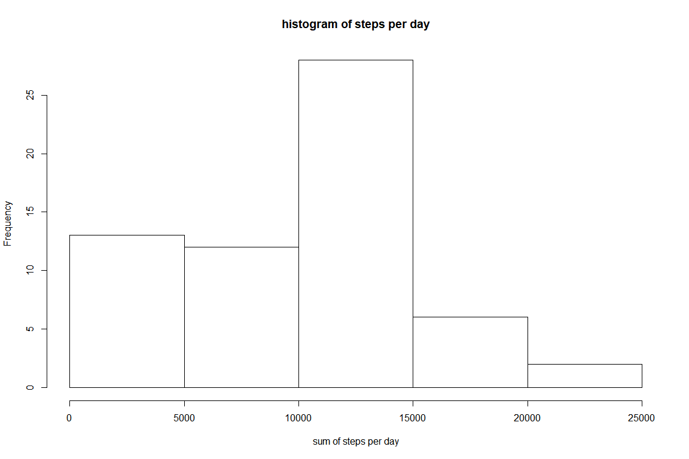
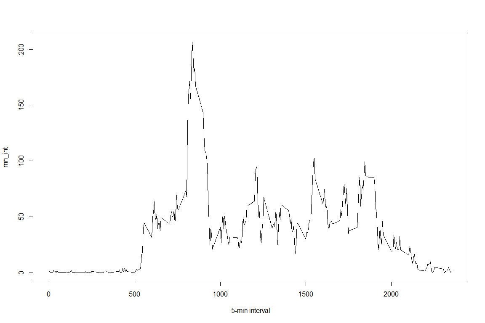
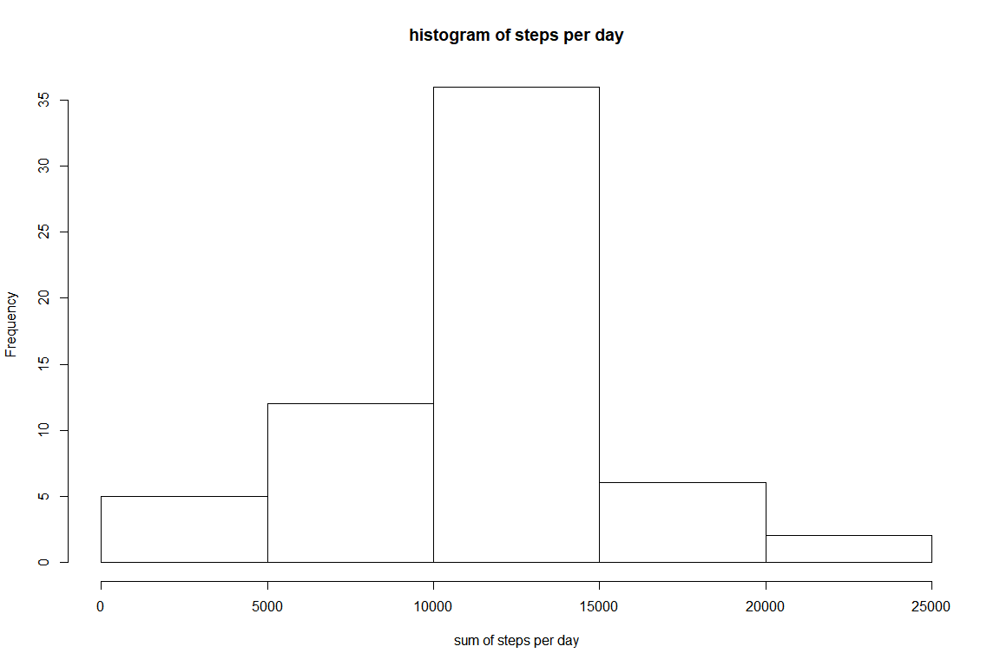
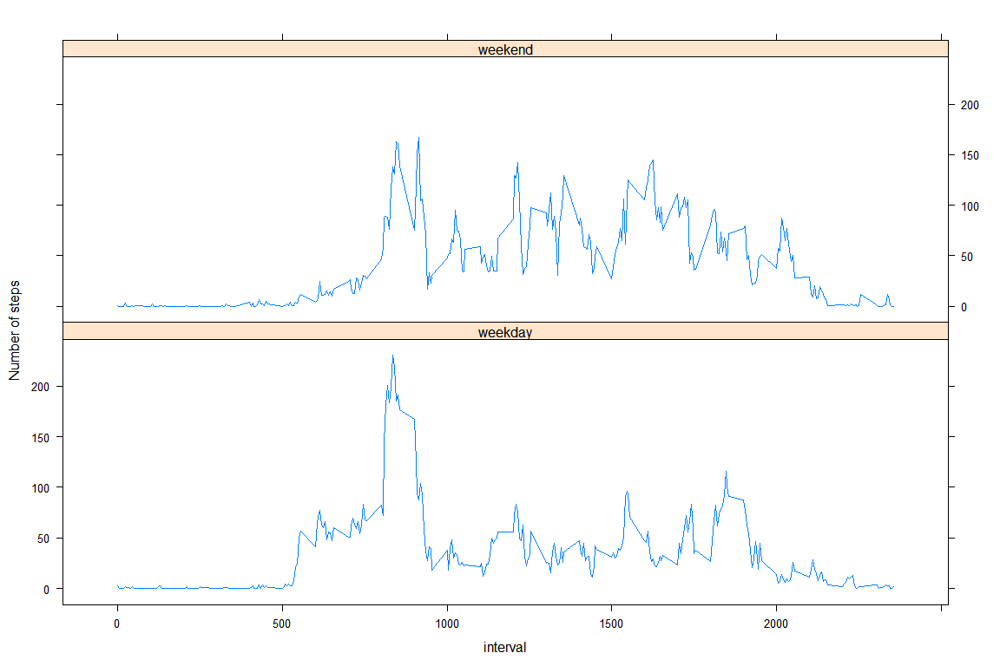

```r
knitr::opts_chunk$set(fig.width=12, fig.height=8,
                      echo=TRUE, warning=FALSE, message=FALSE)
library(ggplot2)
```

```
## Warning: package 'ggplot2' was built under R version 3.4.4
```

```r
setwd("C:/Users/Lalit2026/Desktop/Data Science")
```

##Loading and preprocessing the data


```r
activity <- NULL
activity <- read.csv("activity.csv", header = T, sep = ",")
```

## Print some lines from activity

```r
head(activity)
```

```
##   steps       date interval
## 1    NA 2012-10-01        0
## 2    NA 2012-10-01        5
## 3    NA 2012-10-01       10
## 4    NA 2012-10-01       15
## 5    NA 2012-10-01       20
## 6    NA 2012-10-01       25
```
##First, the total (sum) of steps is determined for every single date

```r
su <- tapply(activity$steps, activity$date, sum, na.rm=T)
```

## Plot the Histogram

```r
hist(su, xlab = "sum of steps per day", main = "histogram of steps per day")
```

<!-- -->

##The mean and the median total number of steps taken per day are reported:

```r
mean_su <- round(mean(su))
median_su <- round(median(su))
print(c("The mean is",mean_su))
```

```
## [1] "The mean is" "9354"
```

```r
print(c("The median is",median_su))
```

```
## [1] "The median is" "10395"
```
##A time series plot of the 5-minute interval and the average number of steps taken (averaged across all days) is shown below:

```r
mn_int <- tapply(activity$steps, activity$interval, mean, na.rm=T)
plot(mn_int ~ unique(activity$interval), type="l", xlab = "5-min interval")
```

<!-- -->
##The 5-minute interval (on average across all the days in the dataset) that contains the maximum number of steps is the following (below are shown the interval showing the max. number of steps and the value of the max. number of steps):

```r
mn_int[which.max(mn_int)]
```

```
##      835 
## 206.1698
```
##Imputing missing values

```r
table(is.na(activity) == TRUE)
```

```
## 
## FALSE  TRUE 
## 50400  2304
```

```r
summary(activity)
```

```
##      steps                date          interval     
##  Min.   :  0.00   2012-10-01:  288   Min.   :   0.0  
##  1st Qu.:  0.00   2012-10-02:  288   1st Qu.: 588.8  
##  Median :  0.00   2012-10-03:  288   Median :1177.5  
##  Mean   : 37.38   2012-10-04:  288   Mean   :1177.5  
##  3rd Qu.: 12.00   2012-10-05:  288   3rd Qu.:1766.2  
##  Max.   :806.00   2012-10-06:  288   Max.   :2355.0  
##  NA's   :2304     (Other)   :15840
```

```r
activity2 <- activity  # creation of the dataset that will have no more NAs
for (i in 1:nrow(activity)){
    if(is.na(activity$steps[i])){
        activity2$steps[i]<- mn_int[[as.character(activity[i, "interval"])]]
    }
}
```
##Below is a histogram of the total number of steps taken each day. The mean and median total number of steps taken per day are reported.

```r
su2 <- tapply(activity2$steps, activity2$date, sum, na.rm=T)
hist(su2, xlab = "sum of steps per day", main = "histogram of steps per day")
```

<!-- -->

```r
mean_su2 <- round(mean(su2))
median_su2 <- round(median(su2))
```
##The new values are :

```r
print(c("The mean is",mean_su2))
```

```
## [1] "The mean is" "10766"
```

```r
print(c("The median is",median_su2))
```

```
## [1] "The median is" "10766"
```
##In order to compare the new values with the "old" values:

```r
df_summary <- NULL
df_summary <- rbind(df_summary, data.frame(mean = c(mean_su, mean_su2), median = c(median_su, median_su2)))
rownames(df_summary) <- c("with NA's", "without NA's")
print(df_summary)
```

```
##               mean median
## with NA's     9354  10395
## without NA's 10766  10766
```
##For comparison with NA's and without (see earlier):

```r
summary(activity2)
```

```
##      steps                date          interval     
##  Min.   :  0.00   2012-10-01:  288   Min.   :   0.0  
##  1st Qu.:  0.00   2012-10-02:  288   1st Qu.: 588.8  
##  Median :  0.00   2012-10-03:  288   Median :1177.5  
##  Mean   : 37.38   2012-10-04:  288   Mean   :1177.5  
##  3rd Qu.: 27.00   2012-10-05:  288   3rd Qu.:1766.2  
##  Max.   :806.00   2012-10-06:  288   Max.   :2355.0  
##                   (Other)   :15840
```
##Are there differences in activity patterns between weekdays and weekends?

```r
activity2$weekday <- c("weekday")
activity2[weekdays(as.Date(activity2[, 2])) %in% c("Saturday", "Sunday", "samedi", "dimanche", "saturday", "sunday", "Samedi", "Dimanche"), ][4] <- c("weekend")
table(activity2$weekday == "weekend")
```

```
## 
## FALSE  TRUE 
## 12960  4608
```

```r
activity2$weekday <- factor(activity2$weekday)
```
##In order to visualize the difference bewteen weekends and days of the week, a new dataframe is created to be usable by the lattice package. First, the data are calculated:

```r
activity2_weekend <- subset(activity2, activity2$weekday == "weekend")
activity2_weekday <- subset(activity2, activity2$weekday == "weekday")

mean_activity2_weekday <- tapply(activity2_weekday$steps, activity2_weekday$interval, mean)
mean_activity2_weekend <- tapply(activity2_weekend$steps, activity2_weekend$interval, mean)
```
##Then the dataframe is prepared and the plot is. plotted !

```r
library(lattice)
df_weekday <- NULL
df_weekend <- NULL
df_final <- NULL
df_weekday <- data.frame(interval = unique(activity2_weekday$interval), avg = as.numeric(mean_activity2_weekday), day = rep("weekday", length(mean_activity2_weekday)))
df_weekend <- data.frame(interval = unique(activity2_weekend$interval), avg = as.numeric(mean_activity2_weekend), day = rep("weekend", length(mean_activity2_weekend)))
df_final <- rbind(df_weekday, df_weekend)

xyplot(avg ~ interval | day, data = df_final, layout = c(1, 2), 
       type = "l", ylab = "Number of steps")
```

<!-- -->
       
